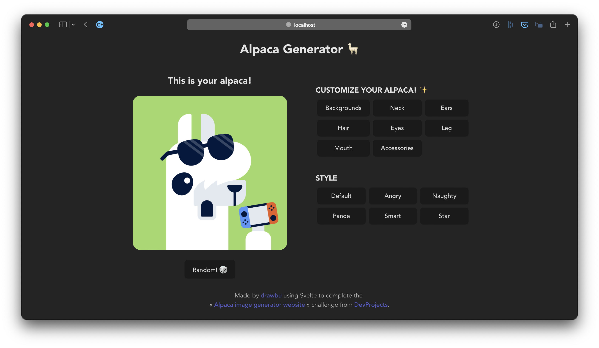

# Alpaca generator

This is my solution to the « [Alpaca image generator website](https://www.codementor.io/projects/web/alpaca-image-generator-website-ce2oc0eus8) » challenge from [DevProjects](https://www.codementor.io/projects).



I used Svelte to do the front-end, and no back-end was required.

You can see a live example on [alpaca.drawbu.dev](https://alapaca.drawbu.dev).

```bash
npm install
npm run dev
```
